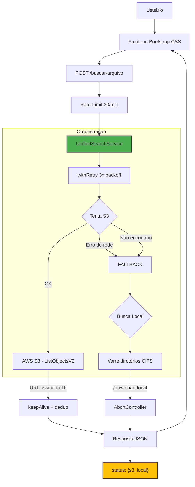

# 🔍 Buscador de Protocolos S3 (s3-protoSearch)

<p align="center">
  
  
  
  
  
</p>

Aplicação web containerizada para busca unificada de arquivos de protocolo (gravações de áudio, documentos) armazenados em **AWS S3** com fallback para **diretórios locais**. Ideal para ambientes híbridos com servidores legados.

---

## 🚀 Funcionalidades

- **Interface Web**: Formulário simples com data e nome do arquivo, step-by-step por servidor, timer de performance e resultados com links de download diretos.
- **Busca Unificada**: Primeiro tenta no S3; se não encontrar (ou houver falha de conexão), busca nos servidores locais.
- **URLs Assinadas (S3)**: Links temporários de 1 hora — sem expor as credenciais da AWS.
- **Download Local Protegido**: Endpoint com validação de path para impedir acesso fora dos diretórios configurados.
- **Diagnóstico Detalhado**: Resposta da API informa individualmente o status de cada fonte (`ok`, `nao_encontrado`, `erro: <motivo>`).
- **Resiliência**: Falha de rede no S3 não quebra o fluxo — o fallback local é executado mesmo com erro.
- **Configuração Flexível**: Múltiplos servidores e estruturas de diretório via `.env`.
- **Keep-Alive nas conexões S3**: Reuso de sockets com pool de 25 conexões, evitando exaustão de portas efêmeras.
- **Retry com backoff**: Requisições S3 falhas são repetidas com exponential backoff + jitter (3 tentativas).
- **Busca paralela com AbortController**: Prefixos de data testados em paralelo via `Promise.all`; ao encontrar, os demais são abortados durante a recursão — redução de ~95% no tempo de fallback local.
- **Rate-limit**: 30 requisições por minuto por IP, com resposta `429` e aviso no log.
- **Docker**: Containerização completa com Dockerfile e docker-compose.

---

## 📦 Pré-requisitos

| Recurso | Versão                           |
| ------- | -------------------------------- |
| Node.js | 20.x                  |
| Docker  | 24+ (recomendado)      |
| Acesso  | AWS S3 + diretório local |

---

## ⚙️ Configuração do Ambiente (.env)

O sistema utiliza um arquivo `.env` na raiz do projeto para todas as configurações.

```env
# Servidor
PORT=80
NODE_ENV=busca-ligacoes

# AWS S3
AWS_ACCESS_KEY_ID=SUA_ACCESS_KEY
AWS_SECRET_ACCESS_KEY=SEU_SECRET_KEY
AWS_BUCKET_NAME=nome-do-bucket
AWS_REGION=sa-east-1

# Busca Local — Sem subpastas
PATH_X5=/sharepoint/pastaPrincipal
YEARS_X5=2021,2022,2023,2024

# Busca Local — Com subpastas
PATH_Z2=/sharepoint/pastaSecundaria,subPasta1;subPasta2
YEARS_Z2=2019,2020,2021
```

### Detalhamento das Variáveis

| Variável                | Obrigatório | Descrição                                                   |
| ----------------------- | ----------- | ----------------------------------------------------------- |
| `PORT`                  | Sim         | Porta do servidor HTTP                                      |
| `NODE_ENV`              | Não         | `busca-ligacoes` ativa a rota de download local             |
| `AWS_ACCESS_KEY_ID`     | Sim         | Chave de acesso AWS                                         |
| `AWS_SECRET_ACCESS_KEY` | Sim         | Chave secreta AWS                                           |
| `AWS_BUCKET_NAME`       | Sim         | Nome do bucket (com ou sem `s3://`)                         |
| `AWS_REGION`            | Sim         | Região do bucket (ex: `sa-east-1`)                          |
| `PATH_<ID>`             | Condicional | Caminho base da busca local + subpastas (após vírgula)      |
| `YEARS_<ID>`            | Condicional | Anos associados ao `PATH_<ID>` correspondente               |

### Estruturas de Diretório Local

O sistema testa **automaticamente 4 variações** da data (`YYYY/M/D`, `YYYY/M/DD`, `YYYY/MM/DD`, `YYYY/MM/D`) em cada servidor configurado, combinando mês e dia com e sem zero à esquerda. Variações redundantes são eliminadas com `Set`.

```text
/sharepoint/pastaPrincipal/2024/1/5      → sem zero
/sharepoint/pastaPrincipal/2024/1/5      ← duplicado, descartado
/sharepoint/pastaPrincipal/2024/01/05    → com zero no mês/dia
/sharepoint/pastaPrincipal/2024/01/5     ← duplicado, descartado
```

As buscas são feitas em **paralelo** via `Promise.all` com `AbortController` — assim que um prefixo encontra o arquivo, os demais são abortados durante a recursão.

> Exemplo de subpastas: `PATH_Z2=/sharepoint/pastaSecundaria,subPasta1;subPasta2` faz a busca em `/sharepoint/pastaSecundaria/subPasta1` e `/sharepoint/pastaSecundaria/subPasta2`.

---

## 📂 Estrutura do Projeto

```
s3-protoSearch/
├── .env.example                  # Template de configuração (commitável)
├── docker-compose.yml            # Orquestração Docker (teste local)
├── Dockerfile                    # Imagem Node 20-alpine
├── package.json
├── src/
│   ├── server.js                 # Entry point
│   ├── app.js                    # Express app + rota /download-local
│   ├── routes/
│   │   └── search.js             # POST /buscar-arquivo
│   ├── services/
│   │   ├── unifiedSearchService.js   # Orquestrador S3 → Local
│   │   ├── s3SearchService.js        # Busca no S3 com prefixos
│   │   └── localSearchService.js     # Busca em diretórios locais
│   └── utils/
│       ├── errorCodes.js             # Mapa de erros AWS/rede
│       ├── retry.js                  # Exponential backoff com jitter
│       └── logger.js                 # Logger estruturado com cores
└── public/
    ├── index.html                # Interface web (glassmorphism + templates)
    ├── style.css                 # Paleta TRON + light mode
    ├── vendor/
    │   ├── bootstrap.min.css     # Bootstrap local (sem CDN)
    │   └── bootstrap.min.js
    └── js/
        ├── utils.js              # escapeHtml
        ├── theme.js              # Toggle dark/light com localStorage
        ├── search.js             # Form submit + fetch + erro
        └── render.js             # Template cloning de resultados
```

---

## 🔌 API — Formato da Resposta

### `POST /buscar-arquivo`

**Request:**

```json
{ "pasta": "2024-05-26", "nomeProtocolo": "audio-12345.mp3" }
```

**Response — Arquivo encontrado (200):**

```json
{
  "encontrado": true,
  "arquivos": [
    {
      "downloadUrl": "https://s3-assinado...",
      "nomeParaDownload": "audio-12345.mp3"
    }
  ],
  "status": {
    "s3": "ok",
    "local": "nao_consultado"
  }
}
```

**Response — Não encontrado (404):**

```json
{
  "encontrado": false,
  "arquivos": null,
  "status": {
    "s3": "nao_encontrado",
    "local": "nao_encontrado"
  }
}
```

**Response — S3 com erro de conexão + local falhou (404):**

```json
{
  "encontrado": false,
  "arquivos": null,
  "status": {
    "s3": "erro: getaddrinfo EAI_AGAIN nome-do-bucket.s3.sa-east-1.amazonaws.com",
    "local": "nao_encontrado"
  }
}
```

| Campo `status.s3` / `status.local` | Significado                                    |
| ---------------------------------- | ---------------------------------------------- |
| `ok`                               | Fonte consultada e arquivo encontrado          |
| `nao_encontrado`                   | Fonte consultada mas sem resultado             |
| `nao_consultado`                   | Fonte não foi consultada (a anterior já achou) |
| `erro: <mensagem>`                 | Falha na consulta (rede, DNS, permissão)       |

---

## 🚀 Instalação e Execução

### Docker (recomendado)

```bash
git clone <URL_DO_REPOSITORIO>
cd s3-protoSearch
cp .env.example .env        # Configure suas credenciais
docker compose up -d         # ou: docker-compose up -d
```

Acesse: `http://localhost:80`

### Desenvolvimento (sem Docker)

```bash
npm install
npm run dev                  # Node --watch com auto-restart
```

### Lint e Formatação

```bash
npm run lint                 # Verifica código
npm run lint:fix             # Corrige automaticamente
npm run format               # Formata com Prettier
```

---

## ⚡ Otimizações de Performance

### S3 — Keep-Alive e Pool de Conexões

O cliente S3 utiliza `https.Agent` com `keepAlive: true` e `maxSockets: 25` — as conexões TLS são reutilizadas em vez de abertas e fechadas a cada requisição. Isso elimina o acúmulo de sockets em estado `TIME_WAIT` e previne exaustão de portas efêmeras.

### S3 — Deduplicação de Prefixos

A função `generatePrefixes` produz 4 variações de prefixo (`YYYY/M/D`, `YYYY/M/DD`, `YYYY/MM/DD`, `YYYY/MM/D`) e as deduplica com `new Set()`. Em dias e meses ≥ 10, apenas 1 ou 2 prefixos únicos são testados em vez de 4.

### S3 — Retry com Exponential Backoff

Requisições ao S3 (`ListObjectsV2`, `getSignedUrl`) são envolvidas por `withRetry`, que tenta até 3 vezes com delay progressivo + jitter aleatório. A primeira tentativa falha espera 500ms, a segunda 1000ms, evitando picos repentinos de retry.

### Local — Busca Paralela com AbortController

Os 4 prefixos de data são testados em paralelo via `Promise.all`. Cada prefixo executa `listFilesRecursively` de forma independente. Quando um prefixo encontra o arquivo, `AbortController.abort()` é disparado — os demais prefixos recebem o sinal e interrompem a recursão no próximo `readdir`, retornando array vazio. Isso reduz o tempo de fallback local de ~7s para ~330ms em servidores com dezenas de milhares de arquivos.

### Local — I/O Assíncrona

Todo o acesso a diretórios e arquivos usa `fs.promises` (`readdir`, `stat`, `access`) em vez dos equivalentes síncronos (`readdirSync`, `existsSync`, `statSync`), permitindo que o event loop do Node.js atenda outras requisições durante a espera por I/O de rede (CIFS).

---

## 🛠 Estrutura do Sistema

| Módulo             | Tipo            | Função                                                              |
| ------------------ | --------------- | ------------------------------------------------------------------- |
| **Express**        | Servidor        | HTTP + rotas + rate-limit + headers de segurança                    |
| **S3 Client**      | SDK AWS         | Listagem de objetos + keep-alive (pool 25 sockets) + URLs assinadas |
| **Local Search**   | FS Node/promises | Leitura recursiva assíncrona com AbortController + prefixos paralelos |
| **Unified Search** | Orquestrador    | Sequência S3 → fallback local com resiliência                       |
| **Utils**          | errorCodes, retry, logger | Tradução de erros, exponential backoff, logs estruturados |
| **Docker**         | Container       | Isolamento + volume montado                                        |

---

## 🧠 Arquitetura do Sistema



---

## 🐛 Tratamento de Erros

O sistema foi projetado para **nunca retornar um erro 500 genérico sem explicação**:

| Situação                              | Comportamento                                      |
| ------------------------------------- | -------------------------------------------------- |
| S3 caiu (DNS, timeout, firewall)      | Loga o erro, executa fallback local                |
| S3 caiu + local achou                 | `200` com `status.s3: "erro: ..."` e `local: "ok"` |
| Ambos consultados sem resultado       | `404` com `status` individual por fonte            |
| Path de rede inacessível              | Loga aviso, pula para próxima configuração         |
| Todos os caminhos locais inacessíveis | Status `erro: Nenhum caminho de rede acessivel`    |
| Path traversal detectado              | `403` negado com warn no log                       |
| Rate-limit excedido (30 req/min)      | `429` com aviso no log e no corpo da resposta      |
| Erro genérico no servidor             | `sanitizeError` retorna `Erro interno do servidor` sem vazar detalhes |

---

## 📄 Licença

MIT
