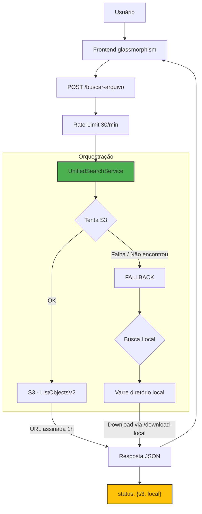

# Buscador de Protocolos S3 (s3-protoSearch)

<p align="center">
  
  
  
  
</p>

Aplicação web containerizada para busca unificada de arquivos de áudio/documentos. Primeiro consulta um bucket S3; se houver falha ou arquivo não encontrado, faz fallback automático para diretório local.

---

## Screenshots

<p align="center">
  
  
</p>
<p align="center">
  
  
</p>
<p align="center">
  
</p>

---

## Funcionalidades

- **Busca unificada S3 → local**: Tenta o S3 primeiro; se falhar ou não encontrar, busca nos diretórios locais automaticamente.
- **URLs assinadas**: Links temporários de 1 hora sem expor credenciais AWS.
- **Fallback resiliente**: Falha de rede no S3 não quebra o fluxo — o fallback local é executado mesmo com erro.
- **Interface glassmorphism**: Tema escuro (TRON) e claro, toggle com persistência em localStorage.
- **Múltiplas estruturas de diretório**: Suporte a subpastas via configuração no `.env`.
- **Componentes sem CDN**: Bootstrap servido localmente, zero dependência externa no frontend.

---

## Arquitetura



---

## Stack

| Tecnologia | Função |
|-----------|--------|
| Node.js 20 + Express 5 | Servidor HTTP |
| AWS SDK v3 (@aws-sdk/client-s3) | Cliente S3 com signed URLs |
| Docker + docker-compose | Containerização |
| Bootstrap 5.3.3 (local) | UI components |
| CSS3 (custom) | Glassmorphism, theme toggle, TRON palette |

---

## ⚙️ Configuração (.env)

```
# Servidor
PORT=80
NODE_ENV=busca-ligacoes

# AWS S3
AWS_ACCESS_KEY_ID=SUA_ACCESS_KEY
AWS_SECRET_ACCESS_KEY=SEU_SECRET_KEY
AWS_BUCKET_NAME=nome-do-bucket
AWS_REGION=sa-east-1

# Busca Local 
PATH_X5=/sharepoint/pastaPrincipal
YEARS_X5=2021,2022,2023,2024

PATH_Z2=/sharepoint/pastaSecundaria,subPasta1;subPasta2
YEARS_Z2=2019,2020,2021
```

### Variáveis

| Variável | Obrigatório | Descrição |
|----------|------------|-----------|
| `PORT` | Sim | Porta do servidor |
| `NODE_ENV` | Não | `busca-ligacoes` ativa download local |
| `AWS_*` | Sim | Credenciais + bucket + região |
| `PATH_<ID>` | Condicional | Caminho base + subpastas (após vírgula) |
| `YEARS_<ID>` | Condicional | Anos associados ao `PATH_<ID>` |

O sistema testa 4 variações de data (`YYYY/M/D`, `YYYY/M/DD`, `YYYY/MM/DD`, `YYYY/MM/D`) em paralelo com `AbortController` — ao encontrar, os demais são abortados.

---

## 📂 Estrutura do Projeto

```
s3-protoSearch/
├── assets/                       # Screenshots do README
├── .env.example                  # Template de configuração
├── docker-compose.yml            # Orquestração Docker
├── Dockerfile                    # Node 20-alpine
├── src/
│   ├── server.js                 # Entry point
│   ├── app.js                    # Express + /download-local
│   ├── routes/search.js          # POST /buscar-arquivo
│   ├── services/
│   │   ├── unifiedSearchService.js   # S3 → Local
│   │   ├── s3SearchService.js        # Busca S3 + signed URLs
│   │   └── localSearchService.js     # Busca em diretório local
│   └── utils/
│       ├── errorCodes.js             # Tradução de erros
│       ├── retry.js                  # Exponential backoff
│       └── logger.js                 # Logger estruturado
└── public/
    ├── index.html                # Glassmorphism + templates
    ├── style.css                 # TRON + light mode
    ├── vendor/                   # Bootstrap local
    └── js/                       # Módulos: utils, theme, search, render
```

---

## API

### `POST /buscar-arquivo`

```json
{ "pasta": "2024-01-05", "nomeProtocolo": "protocolo" }
```

**200 — Arquivo encontrado no S3:**

```json
{
  "encontrado": true,
  "arquivos": [{ "downloadUrl": "https://...", "nomeParaDownload": "protocolo-0001.mp3" }],
  "status": { "s3": "ok", "local": "nao_consultado" }
}
```

**200 — Fallback local atuou:**

```json
{
  "encontrado": true,
  "arquivos": [{ "downloadUrl": "/download-local?file=...", "nomeParaDownload": "protocolo-0001.mp3" }],
  "status": { "s3": "nao_encontrado", "local": "ok" }
}
```

**404 — Não encontrado em nenhuma fonte:**

```json
{
  "encontrado": false,
  "arquivos": null,
  "status": { "s3": "nao_encontrado", "local": "nao_encontrado" }
}
```

### Matriz de Respostas

| `s3.status` | `local.status` | HTTP | Cenário |
|-------------|---------------|------|---------|
| `ok` | `nao_consultado` | **200** | S3 encontrou, fallback não foi necessário |
| `nao_encontrado` | `ok` | **200** | S3 não tinha o arquivo, local encontrou |
| `erro: ...` | `ok` | **200** | S3 indisponível, local assumiu |
| `nao_encontrado` | `nao_encontrado` | **404** | Arquivo não existe em nenhuma fonte |
| `erro: ...` | `erro: ...` | **404** | Ambas as fontes falharam |

### Códigos HTTP

| Código | Quando ocorre |
|--------|--------------|
| **400** | Campos `pasta` ou `nomeProtocolo` ausentes |
| **403** | Path traversal detectado em `/download-local` |
| **404** | Arquivo não encontrado |
| **429** | Rate limit excedido (30 req/min) |
| **500** | Erro interno inesperado |

### Erros AWS S3 — tradução

| Erro original | Mensagem amigável |
|--------------|-------------------|
| `must be addressed` | Endpoint do bucket AWS incorreto. Verifique a região configurada. |
| `access denied` / `signaturedoesnotmatch` | Credenciais AWS inválidas ou sem permissão de acesso. |
| `nosuchbucket` / `allaccessdisabled` | Bucket AWS não encontrado ou acesso desabilitado. |
| `eai_again` / `econnrefused` / `etimedout` / ... | Sistema AWS indisponível no momento. |
| *(qualquer outro)* | Conexão com AWS S3 indisponível. Buscando nos servidores locais... |

### Erros Locais

| Erro | Mensagem |
|------|----------|
| `EACCES` / `EPERM` | Permissão negada ao acessar o servidor local. |
| Nenhum caminho acessível | Nenhum servidor local está acessível no momento. |

---

## Instalação

```bash
git clone <repo>
cd s3-protoSearch
cp .env.example .env            # Configure suas credenciais
docker compose up -d --build
```

Acesse: `http://localhost:80`

### Desenvolvimento (sem Docker)

```bash
npm install
npm run dev                     # Node --watch com auto-restart
```

---

## Licença

MIT
