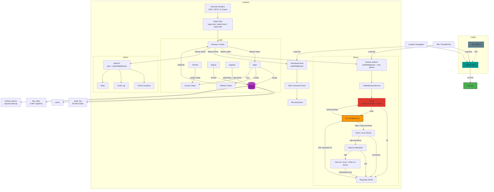

# Buscador de Protocolos S3 (s3-protoSearch)

<p align="center">
  
  
  
  
  
</p>

Aplicação web containerizada para busca unificada de arquivos de áudio/documentos. Primeiro consulta um bucket S3; se houver falha ou arquivo não encontrado, faz fallback automático para diretório local.

---

## Screenshots

<p align="center">
  
  
</p>
<p align="center">
  
  
</p>
<p align="center">
  
</p>

---

## Funcionalidades

- **Busca unificada S3 → local**: Tenta o S3 primeiro; se falhar ou não encontrar, busca nos diretórios locais automaticamente.
- **Pula varredura local se data já indexada**: Diretórios já varridos não são escaneados novamente, reduzindo o tempo de resposta.
- **URLs assinadas**: Links temporários de 1 hora sem expor credenciais AWS.
- **Fallback resiliente**: Falha de rede no S3 não quebra o fluxo — o fallback local é executado mesmo com erro.
- **Autenticação JWT**: Login com access token em memória + refresh token em cookie httpOnly (rotação a cada uso).
- **Painel administrativo**: CRUD de usuários, log de auditoria, estatísticas do sistema.
- **Rate limiting**: Login (5/min), registro (3/min), busca (30/min) — proteção contra brute force.
- **Password policy**: Senha forte (12+ caracteres, maiúscula, minúscula, número, símbolo).
- **Audit logging**: Todas as ações sensíveis registradas no SQLite com rotação de 90 dias.
- **HTTPS + HSTS**: Caddy sidecar com TLS, redirect automático e Strict-Transport-Security.
- **CSP**: Content-Security-Policy bloqueia scripts inline e XSS.
- **RBAC**: Roles `user` e `admin` — acesso a dados restrito por middleware.
- **Interface glassmorphism**: Tema escuro (TRON) e claro, toggle com persistência em localStorage.
- **Múltiplas estruturas de diretório**: Suporte a subpastas via configuração no `.env`.
- **Componentes sem CDN**: Bootstrap servido localmente, zero dependência externa no frontend.
- **Cache Redis por prefixo S3**: Listagens S3 cacheadas por prefixo (TTL 300s), evitando chamadas repetidas ao bucket para arquivos na mesma data. Fallback silencioso se Redis indisponível.

---

## Arquitetura



---

## Stack

| Tecnologia | Função |
|-----------|--------|
| Node.js 22 + Express 5 | Servidor HTTP |
| AWS SDK v3 (@aws-sdk/client-s3) | Cliente S3 com signed URLs |
| Docker + docker-compose | Containerização |
| Caddy 2 | Reverse proxy, TLS interno (self-signed), redirect HTTP→HTTPS |
| Redis 7 + ioredis | Cache de listagens S3 (opcional, fallback silencioso) |
| Bootstrap 5.3.3 (local) | UI components |
| CSS3 (custom) | Glassmorphism, theme toggle, TRON palette |

---

## Modos de Operação

| Modo | Comando | Acesso |
|------|---------|--------|
| **HTTP** (dev/local) | `docker compose -f docker-compose.yml -f docker-compose.http.yml up -d` | `http://host:3000` |
| **HTTPS** (produção) | `docker compose -f docker-compose.yml -f docker-compose.https.yml up -d` | `https://dominio` |

```bash
# HTTP — app exposta na porta 3000
docker compose -f docker-compose.yml -f docker-compose.http.yml up -d --build

# HTTPS — Caddy na 80/443, app apenas na rede interna
docker compose -f docker-compose.yml -f docker-compose.https.yml up -d --build
```

> ⚠️ **Antes do primeiro deploy HTTPS**: edite o `Caddyfile` e substitua `seu-dominio-aqui.com.br` pelo domínio real. O Caddy só aceita conexões TLS para domínios explicitamente listados.

> Em modo HTTPS, apenas as portas 80 e 443 do Caddy ficam expostas.
> A porta 3000 da aplicação fica acessível apenas na rede interna do Docker (exposed, não publicada).
> O Express detecta automaticamente se a requisição chegou por HTTP ou HTTPS via `req.protocol` (Caddy envia `X-Forwarded-Proto`). Cookie `secure` e HSTS são ativados somente quando HTTPS for detectado.

---

## ⚙️ Configuração (.env)

```
# Servidor
NODE_ENV=busca-ligacoes

# Logs
PUBLIC_HOST=seu-dns-ou-ip-publick
PUBLIC_PROTOCOL=http
PORT=3000

# AWS S3
AWS_ACCESS_KEY_ID=SUA_ACCESS_KEY
AWS_SECRET_ACCESS_KEY=SEU_SECRET_KEY
AWS_BUCKET_NAME=nome-do-bucket
AWS_REGION=sa-east-1

# Busca Local 
PATH_X5=/sharepoint/pastaPrincipal
YEARS_X5=2021,2022,2023,2024

PATH_Z2=/sharepoint/pastaSecundaria,subPasta1;subPasta2
YEARS_Z2=2019,2020,2021

# Segurança
JWT_SECRET=minha-chave-super-secreta
API_KEY=key-para-n8n
ADMIN_KEY=chave-para-criar-usuarios
```

### Variáveis

| Variável | Obrigatório | Descrição |
|----------|------------|-----------|
| `PORT` | Não | Porta exibida no log (padrão 3000, apenas informativa) |
| `NODE_ENV` | Não | `busca-ligacoes` ativa download local |
| `PUBLIC_PROTOCOL` | Não | Protocolo público (`http`/`https`), exibido no log |
| `PUBLIC_HOST` | Não | Host público (IP ou DNS), exibido no log |
| `AWS_*` | Sim | Credenciais + bucket + região |
| `PATH_<ID>` | Condicional | Caminho base + subpastas (após vírgula) |
| `YEARS_<ID>` | Condicional | Anos associados ao `PATH_<ID>` |
| `JWT_SECRET` | Sim | Chave para assinar tokens JWT (sem fallback) |
| `API_KEY` | Sim | Chave de API para integração n8n |
| `ADMIN_KEY` | Sim | Chave mestra para criar usuários admin |
| `REDIS_URL` | Não | URL do Redis (ex: `redis://redis:6379`). Cache opcional — fallback silencioso se não configurado |

O sistema testa 4 variações de data (`YYYY/M/D`, `YYYY/M/DD`, `YYYY/MM/DD`, `YYYY/MM/D`) em paralelo com `AbortController` — ao encontrar, os demais são abortados.

---

## 🔒 Segurança

| Medida | Implementação |
|--------|--------------|
| **HTTPS** | Caddy sidecar com `tls internal` + redirect automático HTTP→HTTPS |
| **HSTS** | `Strict-Transport-Security: max-age=31536000; includeSubDomains` (enviado apenas quando HTTPS ativo) |
| **CSP** | `script-src 'self'` — bloqueia inline scripts e XSS |
| **JWT** | Access token em memória (nunca localStorage/sessionStorage) |
| **Refresh token** | Cookie httpOnly + SameSite=Strict + Secure + rotação (invalida após uso) |
| **Rate limit** | Login (5/min), Register (3/min), Busca (30/min) |
| **Password policy** | Mínimo 12 caracteres, maiúscula, minúscula, número e símbolo |
| **RBAC** | Roles `user` e `admin` — admin routes protegidas por `adminMiddleware` |
| **Path traversal** | Validação de resolved path contra base paths configurados |
| **Open redirect** | Parâmetro `redirect` validado como path relativo (`startsWith('/')`) |
| **Audit logging** | Todas ações sensíveis (login, logout, busca, admin CRUD) registradas no SQLite |
| **Secrets** | `JWT_SECRET`, `API_KEY`, `ADMIN_KEY` validados na inicialização — sem fallback |
| **Limpeza** | Refresh tokens expirados e audit logs > 90 dias removidos automaticamente |

---

## 📂 Estrutura do Projeto

```
s3-protoSearch/
├── assets/                       # Screenshots do README
├── .env.example                  # Template de configuração
├── .gitattributes                # Normalização LF
├── .prettierrc                   # Config Prettier
├── Caddyfile                     # Reverse proxy com TLS
├── docker-compose.yml            # Orquestração Docker
├── Dockerfile                    # Node 22-alpine
├── eslint.config.js              # ESLint + Prettier
├── vitest.config.js              # Config Vitest
├── src/
│   ├── server.js                 # Entry point (validação de secrets)
│   ├── app.js                    # Express + CSP + HSTS + rotas
│   ├── db/
│   │   ├── indexDb.js            # SQLite — índice local de arquivos (file_index)
│   │   └── sqlite.js             # SQLite (sql.js) — usuários, tokens, audit
│   ├── middleware/
│   │   └── auth.js               # JWT, loginLimiter, authMiddleware, adminMiddleware
│   ├── routes/
│   │   ├── auth.js               # /login, /refresh, /logout, /me, /register
│   │   ├── search.js             # POST /buscar-arquivo
│   │   ├── download.js           # GET /download-local, /download-s3
│   │   └── admin.js              # CRUD usuários + audit log + stats
│   ├── services/
│   │   ├── unifiedSearchService.js   # S3 → Índice → Local
│   │   ├── s3SearchService.js        # Busca S3 + signed URLs
│   │   └── localSearchService.js     # Busca em diretório local + index on-the-fly
│   └── utils/
│       ├── errorCodes.js             # Tradução de erros
│       ├── retry.js                  # Exponential backoff
│       ├── securityHeaders.js        # CSP, HSTS, X-Frame-Options
│       ├── logger.js                 # Logger estruturado
│       ├── validation.js             # Validação de senha forte
│       └── cache.js                  # Cache Redis com fallback silencioso
├── scripts/
│   ├── indexFiles.js              # Indexação em lote do diretório local
│   └── migrateIndex.js            # Migração app.db → index.db
├── public/
│   ├── login.html                # Login com validação inline
│   ├── admin.html                # Painel admin (CRUD + audit)
│   ├── index.html                # Glassmorphism + templates
│   ├── style.css                 # TRON + light mode
│   ├── vendor/                   # Bootstrap local
│   └── js/                       # Módulos: auth, app, login, admin, search, render, theme, utils
├── test/
│   ├── db/
│   │   ├── sqlite.test.js        # 13 testes
│   │   └── indexDb.test.js       # 10 testes
│   ├── middleware/
│   │   └── auth.test.js          # 14 testes
│   ├── routes/
│   │   ├── auth.test.js          # 23 testes
│   │   ├── admin.test.js         # 24 testes
│   │   ├── search.test.js        # 8 testes
│   │   └── download.test.js      # 8 testes
│   ├── services/
│   │   ├── s3SearchService.test.js       # 8 testes
│   │   ├── localSearchService.test.js    # 4 testes
│   │   └── unifiedSearchService.test.js  # 7 testes
│   └── utils/
│       ├── validation.test.js    # 26 testes
│       ├── errorCodes.test.js    # 15 testes
│       ├── retry.test.js         # 18 testes
│       ├── securityHeaders.test.js  # 7 testes
│       └── cache.test.js        # 12 testes
```

---

## API

### Autenticação

#### `POST /login`

```json
{ "username": "admin", "password": "admin" }
```

**200:**
```json
{ "access_token": "eyJ...", "expires_in": 900 }
```
Define o cookie `refresh_token` (httpOnly, secure, sameSite=strict) com duração de 2,5 horas.

#### `POST /refresh`
(Não requer body — lê o `refresh_token` do cookie)

**200:**
```json
{ "access_token": "eyJ...", "expires_in": 900 }
```

#### `POST /logout`
(Requer `Authorization: Bearer <access_token>`)

**200:** 
```json
{ "message": "Logout realizado" }`
```

#### `GET /me`
(Requer `Authorization: Bearer <access_token>`)

**200:**
```json
{ "id": 1, "username": "admin", "role": "admin" }
```

#### `POST /register`
(Requer `adminKey` mestra para criar usuários — rate limit 3/min)

```json
{ "username": "novouser", "password": "senha123", "adminKey": "chave-mestra" }
```

---

### Busca

#### `POST /buscar-arquivo`
(Requer `Authorization: Bearer <access_token>` ou `x-api-key` — rate limit 30/min)

```json
{ "pasta": "2024-01-05", "nomeProtocolo": "protocolo" }
```

**200 — Arquivo encontrado no S3:**
```json
{
  "encontrado": true,
  "arquivos": [{ "downloadUrl": "https://...", "nomeParaDownload": "protocolo-0001.mp3" }],
  "status": { "s3": "ok", "local": "nao_consultado" }
}
```

**200 — Fallback local atuou:**
```json
{
  "encontrado": true,
  "arquivos": [{ "downloadUrl": "/download-local?file=...", "nomeParaDownload": "protocolo-0001.mp3" }],
  "status": { "s3": "nao_encontrado", "local": "ok" }
}
```

**404 — Não encontrado em nenhuma fonte:**
```json
{
  "encontrado": false,
  "arquivos": null,
  "status": { "s3": "nao_encontrado", "local": "nao_encontrado" }
}
```

#### `GET /download-local`
(Requer `Authorization: Bearer <access_token>` ou `x-api-key` — protegido contra path traversal)

```
?file=/sharepoint/arquivo.mp3
```

#### `GET /download-s3`
(Requer `Authorization: Bearer <access_token>` ou `x-api-key`)

```
?key=2024/01/02/arquivo.mp3&nome=arquivo.mp3
```

- `key`: Caminho S3 do arquivo (obrigatório)
- `nome`: Nome personalizado para download (opcional, header Content-Disposition)
- Retorna **200** com stream do arquivo ou **500** em caso de erro S3

---

### Administração (requer role `admin`)

| Método | Rota | Descrição |
|--------|------|-----------|
| `GET` | `/admin/users` | Lista todos os usuários |
| `POST` | `/admin/users` | Cria usuário (body: `{ username, password, role }`) |
| `PATCH` | `/admin/users/:id` | Atualiza usuário (body: `{ username?, password?, role? }`) |
| `DELETE` | `/admin/users/:id` | Remove usuário |
| `GET` | `/admin/audit` | Log de auditoria paginado |
| `GET` | `/admin/stats` | Estatísticas (total usuários, tokens ativos, ações) |

---

### Matriz de Respostas (Busca)

| `s3.status` | `local.status` | HTTP | Cenário |
|-------------|---------------|------|---------|
| `ok` | `nao_consultado` | **200** | S3 encontrou, fallback não foi necessário |
| `nao_encontrado` | `ok` | **200** | S3 não tinha o arquivo, local encontrou |
| `erro: ...` | `ok` | **200** | S3 indisponível, local assumiu |
| `nao_encontrado` | `nao_encontrado` | **404** | Arquivo não existe em nenhuma fonte |
| `nao_encontrado` | `ja_indexado` | **404** | Diretório já havia sido indexado, arquivo não encontrado |
| `erro: ...` | `erro: ...` | **404** | Ambas as fontes falharam |

### Códigos HTTP

| Código | Quando ocorre |
|--------|--------------|
| **400** | Campos obrigatórios ausentes ou senha fora do padrão |
| **401** | Token ausente, inválido ou expirado |
| **403** | Acesso negado (role insuficiente ou path traversal) |
| **404** | Arquivo ou rota não encontrada |
| **429** | Rate limit excedido (login: 5/min, register: 3/min, search: 30/min) |
| **500** | Erro interno inesperado |

### Erros AWS S3 — tradução

| Erro original | Mensagem amigável |
|--------------|-------------------|
| `must be addressed` | Endpoint do bucket AWS incorreto. Verifique a região configurada. |
| `access denied` / `signaturedoesnotmatch` | Credenciais AWS inválidas ou sem permissão de acesso. |
| `nosuchbucket` / `allaccessdisabled` | Bucket AWS não encontrado ou acesso desabilitado. |
| `eai_again` / `econnrefused` / `etimedout` / ... | Sistema AWS indisponível no momento. |
| *(qualquer outro)* | Conexão com AWS S3 indisponível. Buscando nos servidores locais... |

### Erros Locais

| Erro | Mensagem |
|------|----------|
| `EACCES` / `EPERM` | Permissão negada ao acessar o servidor local. |
| Nenhum caminho acessível | Nenhum servidor local está acessível no momento. |

---

## Instalação

### Pré-requisitos

- Docker + docker-compose
- Acesso ao bucket S3 (credenciais AWS)
- Diretório local de arquivos (montado em `/sharepoint`)

### 1. Clonar e configurar

```bash
git clone <repo>
cd s3-protoSearch
cp .env.example .env
# Edite o .env com suas credenciais (AWS, JWT_SECRET, API_KEY, ADMIN_KEY)
```

### 2. Montar /sharepoint (arquivos locais)

O container espera os arquivos em `/sharepoint` (definido no `docker-compose.yml`):

```yaml
volumes:
  - /sharepoint:/sharepoint:ro
```

**Linux (compartilhamento Samba/NFS):**

```bash
# Montagem manual (teste)
sudo mount -t cifs //servidor/compartilhamento /sharepoint \
  -o username=usuario,password=senha,uid=1000,gid=1000,iocharset=utf8,file_mode=0644,dir_mode=0755

# Para montagem persistente, adicione ao /etc/fstab:
//servidor/compartilhamento /sharepoint cifs username=usuario,password=senha,uid=1000,gid=1000,iocharset=utf8,file_mode=0644,dir_mode=0755 0 0
```

**WSL2 (compartilhamento Windows):**

```bash
sudo mkdir -p /sharepoint
# Se for um caminho local do Windows:
sudo mount -t drvfs 'C:\caminho\local' /sharepoint
# Se for um compartilhamento de rede:
sudo mount -t drvfs '\\servidor\compartilhamento' /sharepoint
```

> O diretório `/sharepoint` deve existir antes de rodar `docker compose up`.

### 3. Banco de dados (/db)

O SQLite é persistido automaticamente em `/db/app.db` via volume no `docker-compose.yml`:

```yaml
volumes:
  - /db:/db
```

- Na primeira execução, as tabelas são criadas automaticamente
- Para **resetar o banco** (remove todos os usuários e tokens):
  ```bash
  docker compose down && sudo rm -f /db/app.db && docker compose up -d
  ```

### 4. Subir o container

```bash
docker compose up -d --build
```

### 5. Criar primeiro usuário admin

```bash
curl -k -X POST https://s3-protosearch.local/register \
  -H "Content-Type: application/json" \
  -d '{"username":"admin","password":"Mudar@123456","adminKey":"SUA_ADMIN_KEY"}'
```

### 6. Acesso DNS

**Sem servidor DNS (teste local):** edite o arquivo `hosts` da máquina:

```bash
echo '127.0.0.1 s3-protosearch.local' | sudo tee -a /etc/hosts
```

Acesse: `https://s3-protosearch.local`

> O Caddy gera certificado auto-assinado (`tls internal`). O navegador exibirá um aviso — prossiga com "Avançado → Prosseguir".

**Com servidor DNS corporativo (AD Samba, Windows Server, BIND):**

Crie um registro **A** apontando o hostname para o IP do servidor:

| Campo | Exemplo |
|-------|---------|
| Nome | `s3-protosearch` |
| Domínio | `intranet.empresa.com` |
| Tipo | `A` |
| Valor | `192.168.x.x` (IP do servidor) |

Após criado, ajuste o `Caddyfile` com o hostname real:

```
seu-dominio-aqui.com.br {
    tls internal
    reverse_proxy s3-protosearch:80
}
```

### 7. Certificado TLS (produção)

| Cenário | Ação no Caddyfile |
|---------|------------------|
| **DNS público** | Remover `tls internal` — Caddy obtém Let's Encrypt automaticamente |
| **CA corporativa** | `tls /caminho/cert.pem /caminho/key.pem` |
| **Teste/self-signed** | Manter `tls internal` (padrão) |

---

### Desenvolvimento (sem Docker)

```bash
npm install
cp .env.example .env            # Configure suas credenciais
npm run dev                     # Node --watch com auto-restart
```

> Em desenvolvimento sem Docker, o Caddy não está disponível. Acesse via `http://localhost:PORT`. O cookie refresh_token não terá a flag `secure` (esperado para HTTP local).

---

## Testes

**201 testes — 15 arquivos — Vitest + Supertest**

| Comando | Descrição |
|---------|-----------|
| `npm test` | Roda todos os testes uma vez |
| `npm run test:watch` | Modo watch (desenvolvimento) |
| `npm run lint` | Verifica lint (ESLint + Prettier) |
| `npm run lint:fix` | Corrige lint automaticamente |
| `npm run format` | Formata código com Prettier |

### Cobertura por fase

| Fase | Arquivos | Testes |
|------|----------|--------|
| Foundation (validação, erros) | 2 | 41 |
| Database (sqlite, indexDb) | 2 | 23 |
| Middleware + Utilitários | 3 | 39 |
| Cache Redis | 1 | 12 |
| Services (S3, Local, Unificado) | 3 | 23 |
| Routes (auth, admin, search, download) | 4 | 63 |

---

## Cache Redis (Fase 3)

Cache opcional baseado em Redis para evitar chamadas repetidas ao S3.

### Comportamento

| Chave | TTL | Descrição |
|-------|-----|-----------|
| `s3-list:{prefixo}` | 300s | Listing completo do prefixo S3 (ex: `2025/4/4/`) |
| `busca:{pasta}:{termo}` | 300s | Resultado unificado da busca |

### Estratégia

1. **Primeira busca** no prefixo → `ListObjectsV2` (S3) → cacheia listing inteiro no Redis
2. **Buscas seguintes** no mesmo prefixo → filtra listing cacheado localmente (ms)
3. **Se Redis cai** → fallback silencioso, busca S3 direto

### Ativação

- **Docker**: `REDIS_URL=redis://redis:6379` (configurado automaticamente no `docker-compose.yml`)
- **Local**: Descomente `REDIS_URL=redis://localhost:6379` no `.env`
- **Sem Redis**: App funciona normalmente, sem cache

### Connect Timeout

Redis tem timeout de 2s (`connectTimeout: 2000`). Se Redis estiver offline, a busca continua normalmente via S3 com overhead máximo de 2s.

---

## Licença

MIT
