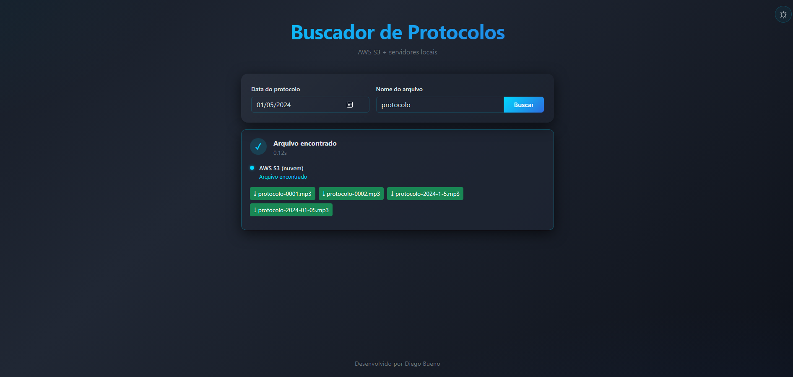
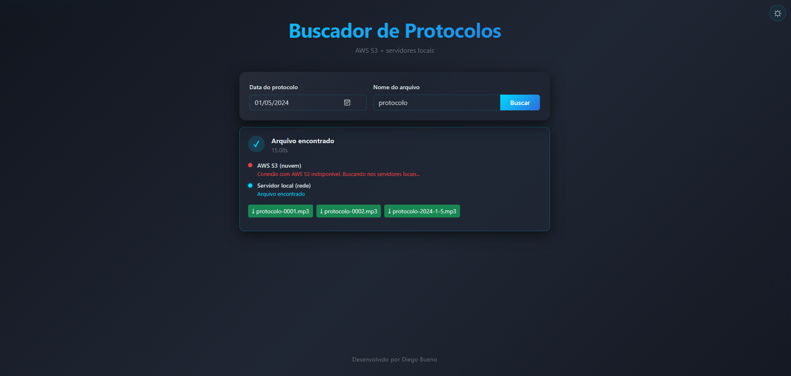
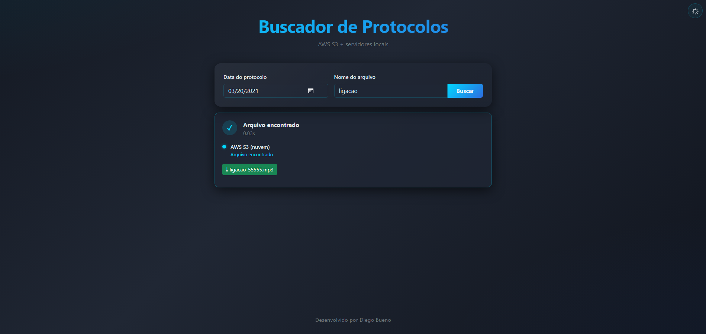
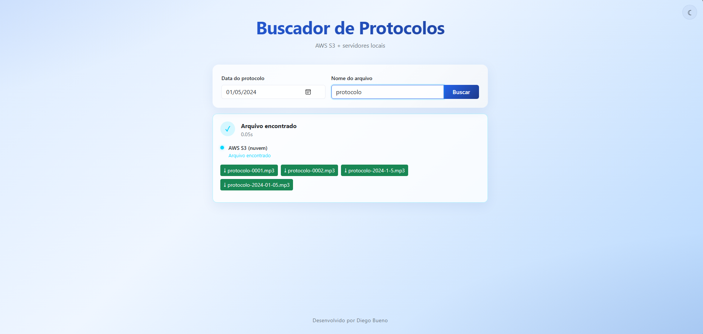
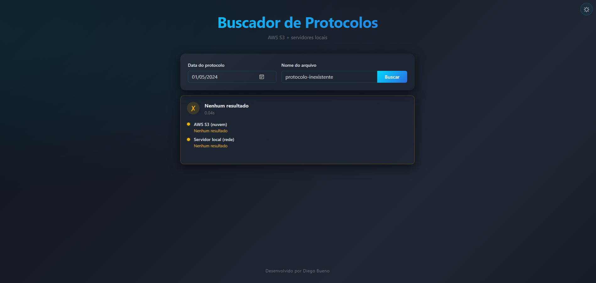
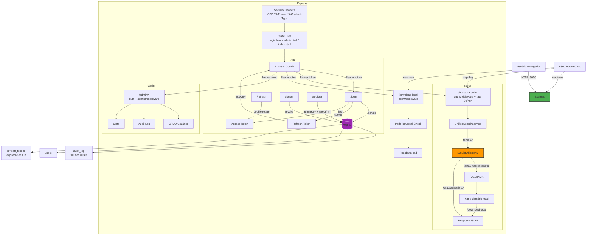

# Buscador de Protocolos S3 (s3-protoSearch)

<p align="center">
  
  
  
  
</p>

Aplicação web containerizada para busca unificada de arquivos de áudio/documentos. Primeiro consulta um bucket S3; se houver falha ou arquivo não encontrado, faz fallback automático para diretório local.

---

## Screenshots

<p align="center">
  
  
</p>
<p align="center">
  
  
</p>
<p align="center">
  
</p>

---

## Funcionalidades

- **Busca unificada S3 → local**: Tenta o S3 primeiro; se falhar ou não encontrar, busca nos diretórios locais automaticamente.
- **URLs assinadas**: Links temporários de 1 hora sem expor credenciais AWS.
- **Fallback resiliente**: Falha de rede no S3 não quebra o fluxo — o fallback local é executado mesmo com erro.
- **Autenticação JWT**: Login com access token em memória + refresh token em cookie httpOnly (rotação a cada uso).
- **Painel administrativo**: CRUD de usuários, log de auditoria, estatísticas do sistema.
- **Rate limiting**: Login (5/min), registro (3/min), busca (30/min) — proteção contra brute force.
- **Password policy**: Senha forte (6+ caracteres, maiúscula, minúscula, número, símbolo).
- **Audit logging**: Todas as ações sensíveis registradas no SQLite com rotação de 90 dias.
- **CSP**: Content-Security-Policy bloqueia scripts inline e XSS.
- **RBAC**: Roles `user` e `admin` — acesso a dados restrito por middleware.
- **Interface glassmorphism**: Tema escuro (TRON) e claro, toggle com persistência em localStorage.
- **Múltiplas estruturas de diretório**: Suporte a subpastas via configuração no `.env`.
- **Componentes sem CDN**: Bootstrap servido localmente, zero dependência externa no frontend.

---

## Arquitetura



---

## Stack

| Tecnologia | Função |
|-----------|--------|
| Node.js 20 + Express 5 | Servidor HTTP |
| AWS SDK v3 (@aws-sdk/client-s3) | Cliente S3 com signed URLs |
| Docker + docker-compose | Containerização |
| — | Sem proxy reverso — HTTPS indisponível (domínio interno sem ADCS) |
| Bootstrap 5.3.3 (local) | UI components |
| CSS3 (custom) | Glassmorphism, theme toggle, TRON palette |

---

## ⚙️ Configuração (.env)

```
# Servidor
PORT=3000
NODE_ENV=busca-ligacoes

# AWS S3
AWS_ACCESS_KEY_ID=SUA_ACCESS_KEY
AWS_SECRET_ACCESS_KEY=SEU_SECRET_KEY
AWS_BUCKET_NAME=nome-do-bucket
AWS_REGION=sa-east-1

# Busca Local 
PATH_X5=/sharepoint/pastaPrincipal
YEARS_X5=2021,2022,2023,2024

PATH_Z2=/sharepoint/pastaSecundaria,subPasta1;subPasta2
YEARS_Z2=2019,2020,2021

# Segurança
JWT_SECRET=minha-chave-super-secreta
API_KEY=key-para-n8n
ADMIN_KEY=chave-para-criar-usuarios
```

### Variáveis

| Variável | Obrigatório | Descrição |
|----------|------------|-----------|
| `PORT` | Sim | Porta do servidor (padrão 3000) |
| `NODE_ENV` | Não | `busca-ligacoes` ativa download local |
| `AWS_*` | Sim | Credenciais + bucket + região |
| `PATH_<ID>` | Condicional | Caminho base + subpastas (após vírgula) |
| `YEARS_<ID>` | Condicional | Anos associados ao `PATH_<ID>` |
| `JWT_SECRET` | Sim | Chave para assinar tokens JWT (sem fallback) |
| `API_KEY` | Sim | Chave de API para integração n8n |
| `ADMIN_KEY` | Sim | Chave mestra para criar usuários admin |

O sistema testa 4 variações de data (`YYYY/M/D`, `YYYY/M/DD`, `YYYY/MM/DD`, `YYYY/MM/D`) em paralelo com `AbortController` — ao encontrar, os demais são abortados.

---

## 🔒 Segurança

| Medida | Implementação |
|--------|--------------|
| **CSP** | `script-src 'self'` — bloqueia inline scripts e XSS |
| **JWT** | Access token em memória (nunca localStorage/sessionStorage) |
| **Refresh token** | Cookie httpOnly + SameSite=Strict + rotação (invalida após uso) |
| **Rate limit** | Login (5/min), Register (3/min), Busca (30/min) |
| **Password policy** | Mínimo 6 caracteres, maiúscula, minúscula, número e símbolo |
| **RBAC** | Roles `user` e `admin` — admin routes protegidas por `adminMiddleware` |
| **Path traversal** | Validação de resolved path contra base paths configurados |
| **Open redirect** | Parâmetro `redirect` validado como path relativo (`startsWith('/')`) |
| **Audit logging** | Todas ações sensíveis (login, logout, busca, admin CRUD) registradas no SQLite |
| **Secrets** | `JWT_SECRET`, `API_KEY`, `ADMIN_KEY` validados na inicialização — sem fallback |
| **Limpeza** | Refresh tokens expirados e audit logs > 90 dias removidos automaticamente |

> **Nota sobre a ausência de HTTPS:** A aplicação opera em rede corporativa interna
> (`matriz.empresa.local`) sem certificado confiável (ADCS não disponível,
> Let's Encrypt inviável para domínio interno). Credenciais trafegam em texto plano —
> risco aceito e mitigado por:
> - Rede isolada (sem saída para internet)
> - Acesso físico/AD controlado
> - Rate limiting contra brute force
> - Refresh token com rotação + expiração curta (4h)

---

## 📂 Estrutura do Projeto

```
s3-protoSearch/
├── assets/                       # Screenshots do README
├── .env.example                  # Template de configuração
├── .gitattributes                # Normalização LF
├── docker-compose.yml            # Orquestração Docker
├── Dockerfile                    # Node 20-alpine
├── src/
│   ├── server.js                 # Entry point (validação de secrets)
│   ├── app.js                    # Express + CSP + HSTS + rotas
│   ├── db/
│   │   └── sqlite.js             # SQLite (sql.js) — usuários, tokens, audit
│   ├── middleware/
│   │   └── auth.js               # JWT, loginLimiter, authMiddleware, adminMiddleware
│   ├── routes/
│   │   ├── auth.js               # /login, /refresh, /logout, /me, /register
│   │   ├── search.js             # POST /buscar-arquivo
│   │   ├── download.js           # GET /download-local
│   │   └── admin.js              # CRUD usuários + audit log + stats
│   ├── services/
│   │   ├── unifiedSearchService.js   # S3 → Local
│   │   ├── s3SearchService.js        # Busca S3 + signed URLs
│   │   └── localSearchService.js     # Busca em diretório local
│   └── utils/
│       ├── errorCodes.js             # Tradução de erros
│       ├── retry.js                  # Exponential backoff
│       ├── logger.js                 # Logger estruturado
│       └── validation.js             # Validação de senha forte
├── public/
│   ├── login.html                # Login com validação inline
│   ├── admin.html                # Painel admin (CRUD + audit)
│   ├── index.html                # Glassmorphism + templates
│   ├── style.css                 # TRON + light mode
│   ├── vendor/                   # Bootstrap local
│   └── js/                       # Módulos: auth, app, login, admin, search, render, theme, utils
```

---

## API

### Autenticação

#### `POST /login`

```json
{ "username": "admin", "password": "admin" }
```

**200:**
```json
{ "access_token": "eyJ...", "expires_in": 900 }
```
Define o cookie `refresh_token` (httpOnly, sameSite=strict) com duração de 4 horas.

#### `POST /refresh`
(Não requer body — lê o `refresh_token` do cookie)

**200:**
```json
{ "access_token": "eyJ...", "expires_in": 900 }
```

#### `POST /logout`
(Requer `Authorization: Bearer <access_token>`)

**200:** 
```json
{ "message": "Logout realizado" }`
```

#### `GET /me`
(Requer `Authorization: Bearer <access_token>`)

**200:**
```json
{ "id": 1, "username": "admin", "role": "admin" }
```

#### `POST /register`
(Requer `adminKey` mestra para criar usuários — rate limit 3/min)

```json
{ "username": "novouser", "password": "senha123", "adminKey": "chave-mestra" }
```

---

### Busca

#### `POST /buscar-arquivo`
(Requer `Authorization: Bearer <access_token>` ou `x-api-key` — rate limit 30/min)

```json
{ "pasta": "2024-01-05", "nomeProtocolo": "protocolo" }
```

**200 — Arquivo encontrado no S3:**
```json
{
  "encontrado": true,
  "arquivos": [{ "downloadUrl": "https://...", "nomeParaDownload": "protocolo-0001.mp3" }],
  "status": { "s3": "ok", "local": "nao_consultado" }
}
```

**200 — Fallback local atuou:**
```json
{
  "encontrado": true,
  "arquivos": [{ "downloadUrl": "/download-local?file=...", "nomeParaDownload": "protocolo-0001.mp3" }],
  "status": { "s3": "nao_encontrado", "local": "ok" }
}
```

**404 — Não encontrado em nenhuma fonte:**
```json
{
  "encontrado": false,
  "arquivos": null,
  "status": { "s3": "nao_encontrado", "local": "nao_encontrado" }
}
```

#### `GET /download-local`
(Requer `Authorization: Bearer <access_token>` ou `x-api-key` — protegido contra path traversal)

```
?file=/sharepoint/arquivo.mp3
```

---

### Administração (requer role `admin`)

| Método | Rota | Descrição |
|--------|------|-----------|
| `GET` | `/admin/users` | Lista todos os usuários |
| `POST` | `/admin/users` | Cria usuário (body: `{ username, password, role }`) |
| `PATCH` | `/admin/users/:id` | Atualiza usuário |
| `DELETE` | `/admin/users/:id` | Remove usuário |
| `GET` | `/admin/audit` | Log de auditoria paginado |
| `GET` | `/admin/stats` | Estatísticas (total usuários, tokens ativos, ações) |

---

### Matriz de Respostas (Busca)

| `s3.status` | `local.status` | HTTP | Cenário |
|-------------|---------------|------|---------|
| `ok` | `nao_consultado` | **200** | S3 encontrou, fallback não foi necessário |
| `nao_encontrado` | `ok` | **200** | S3 não tinha o arquivo, local encontrou |
| `erro: ...` | `ok` | **200** | S3 indisponível, local assumiu |
| `nao_encontrado` | `nao_encontrado` | **404** | Arquivo não existe em nenhuma fonte |
| `erro: ...` | `erro: ...` | **404** | Ambas as fontes falharam |

### Códigos HTTP

| Código | Quando ocorre |
|--------|--------------|
| **400** | Campos obrigatórios ausentes ou senha fora do padrão |
| **401** | Token ausente, inválido ou expirado |
| **403** | Acesso negado (role insuficiente ou path traversal) |
| **404** | Arquivo ou rota não encontrada |
| **429** | Rate limit excedido (login: 5/min, register: 3/min, search: 30/min) |
| **500** | Erro interno inesperado |

### Erros AWS S3 — tradução

| Erro original | Mensagem amigável |
|--------------|-------------------|
| `must be addressed` | Endpoint do bucket AWS incorreto. Verifique a região configurada. |
| `access denied` / `signaturedoesnotmatch` | Credenciais AWS inválidas ou sem permissão de acesso. |
| `nosuchbucket` / `allaccessdisabled` | Bucket AWS não encontrado ou acesso desabilitado. |
| `eai_again` / `econnrefused` / `etimedout` / ... | Sistema AWS indisponível no momento. |
| *(qualquer outro)* | Conexão com AWS S3 indisponível. Buscando nos servidores locais... |

### Erros Locais

| Erro | Mensagem |
|------|----------|
| `EACCES` / `EPERM` | Permissão negada ao acessar o servidor local. |
| Nenhum caminho acessível | Nenhum servidor local está acessível no momento. |

---

## Instalação

### Pré-requisitos

- Docker + docker-compose
- Acesso ao bucket S3 (credenciais AWS)
- Diretório local de arquivos (montado em `/sharepoint`)

### 1. Clonar e configurar

```bash
git clone <repo>
cd s3-protoSearch
cp .env.example .env
# Edite o .env com suas credenciais (AWS, JWT_SECRET, API_KEY, ADMIN_KEY)
```

### 2. Montar /sharepoint (arquivos locais)

O container espera os arquivos em `/sharepoint` (definido no `docker-compose.yml`):

```yaml
volumes:
  - /sharepoint:/sharepoint:ro
```

**Linux (compartilhamento Samba/NFS):**

```bash
# Montagem manual (teste)
sudo mount -t cifs //servidor/compartilhamento /sharepoint \
  -o username=usuario,password=senha,uid=1000,gid=1000,iocharset=utf8,file_mode=0644,dir_mode=0755

# Para montagem persistente, adicione ao /etc/fstab:
//servidor/compartilhamento /sharepoint cifs username=usuario,password=senha,uid=1000,gid=1000,iocharset=utf8,file_mode=0644,dir_mode=0755 0 0
```

**WSL2 (compartilhamento Windows):**

```bash
sudo mkdir -p /sharepoint
# Se for um caminho local do Windows:
sudo mount -t drvfs 'C:\caminho\local' /sharepoint
# Se for um compartilhamento de rede:
sudo mount -t drvfs '\\servidor\compartilhamento' /sharepoint
```

> O diretório `/sharepoint` deve existir antes de rodar `docker compose up`.

### 3. Banco de dados (/db)

O SQLite é persistido automaticamente em `/db/app.db` via volume no `docker-compose.yml`:

```yaml
volumes:
  - /db:/db
```

- Na primeira execução, as tabelas são criadas automaticamente
- Para **resetar o banco** (remove todos os usuários e tokens):
  ```bash
  docker compose down && sudo rm -f /db/app.db && docker compose up -d
  ```

### 4. Subir o container

```bash
docker compose up -d --build
```

### 5. Criar primeiro usuário admin

```bash
curl -X POST http://<ip-do-servidor>:3000/register \
  -H "Content-Type: application/json" \
  -d '{"username":"admin","password":"Admin@123","adminKey":"SUA_ADMIN_KEY"}'
```

### 6. Acesso

```
http://<ip-do-servidor>:3000
```

> Sem HTTPS (rede corporativa interna, sem certificado confiável).  
> Credenciais trafegam em texto plano — ver nota de segurança acima.

---

### Desenvolvimento (sem Docker)

```bash
npm install
cp .env.example .env            # Configure suas credenciais
npm run dev                     # Node --watch com auto-restart
```

> Acesse via `http://localhost:PORT`.

---

## Licença

MIT
